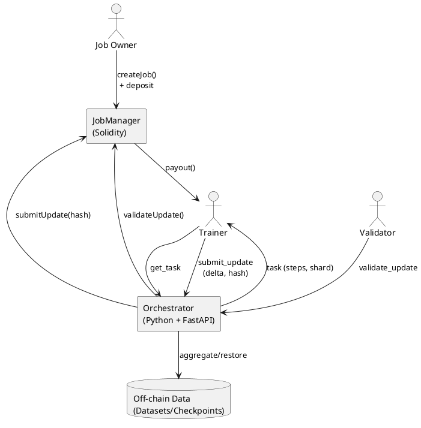
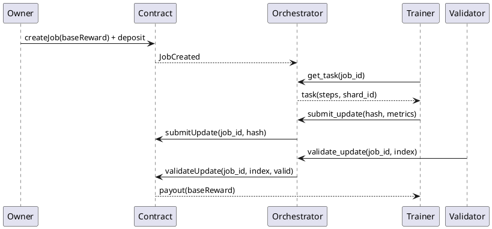
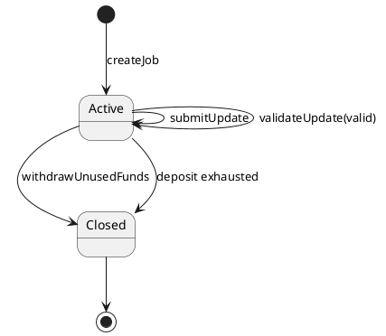

# Белая книга: Parallel Funetun

> Версия: 0.1 (рабочая)  
> Дата: 2026-01-23  
> Репозиторий: `parallel__funetun`

## Аннотация

Parallel Funetun — прототип системы распределенного обучения нейросетей, где вычисления выполняются off-chain, а контроль целостности и выплаты фиксируются on-chain. Роли разделены на заказчика задания, тренеров (GPU‑участников), валидаторов и оркестратора. Смарт‑контракт управляет депозитами и выплатами, а оркестратор распределяет микрозадачи, собирает дельты и инициирует валидацию.

Документ стремится к математической строгости: вводятся определения, формулы для обновления параметров, модели агрегации и правила выплат. Схемы представлены в нотации PlantUML (plantumlweb).

## 1. Обозначения и базовые определения

- $\\mathcal{D}$ — исходный датасет, разбитый на шарды $\\{\\mathcal{D}_k\\}_{k=1}^K$.
- $\\theta \\in \\mathbb{R}^d$ — параметры модели.
- $\\ell(\\theta; x, y)$ — функция потерь.
- $\\nabla \\ell$ — градиент по $\\theta$.
- $t$ — индекс раунда глобального обучения.
- $i$ — индекс тренера.
- $\\Delta_i^{(t)}$ — дельта‑обновление от тренера $i$ на раунде $t$.
- $H(\\cdot)$ — криптографическая хэш‑функция (Keccak/SHA‑256).
- $B$ — депозит задания (в смарт‑контракте).
- $R$ — базовая награда за валидное обновление.

## 2. Роли и ответственность

1) **Заказчик (Job Owner)**:  
   Создает задачу, вносит депозит $B$, получает итоговые веса модели.

2) **Тренер (Trainer)**:  
   Выполняет локальные шаги обучения на шарде данных и отправляет дельту.

3) **Валидатор (Validator)**:  
   Проверяет корректность обновления (повторным обучением или spot‑check).

4) **Оркестратор (Job Leader)**:  
   Распределяет микрозадачи, агрегирует обновления, координирует валидацию.

## 3. Архитектура системы

### 3.1 Контекстная схема



### 3.2 Поток выполнения (последовательность)



## 4. Математическая модель обучения

### 4.1 Локальные шаги тренера

Тренер выполняет $S$ локальных шагов стохастического градиентного спуска:

$$
\\theta_{i}^{(t, s+1)} = \\theta_{i}^{(t, s)} - \\eta \\nabla \\ell(\\theta_{i}^{(t, s)}; x_s, y_s),
\\quad s=0,\\dots,S-1
$$

Итоговая дельта:

$$
\\Delta_i^{(t)} = \\theta_{i}^{(t, S)} - \\theta^{(t)}
$$

Хэшируется и фиксируется on‑chain:

$$
h_i^{(t)} = H(\\Delta_i^{(t)})
$$

### 4.2 Агрегация обновлений

Пусть $\\mathcal{V}^{(t)}$ — множество валидных дельт раунда $t$.

**Среднее (mean):**
$$
\\Delta^{(t)} = \\frac{1}{|\\mathcal{V}^{(t)}|} \\sum_{i \\in \\mathcal{V}^{(t)}} \\Delta_i^{(t)}
$$

**Координатная медиана:**
$$
\\Delta^{(t)}_j = \\operatorname{median}\\{\\Delta_{i,j}^{(t)}\\}
$$

**Trimmed mean:**
$$
\\Delta^{(t)}_j = \\frac{1}{|\\mathcal{V}^{(t)}|-2q} \\sum_{i \\in \\mathcal{V}^{(t)} \\setminus \\text{top/bottom }q} \\Delta_{i,j}^{(t)}
$$

Глобальное обновление:

$$
\\theta^{(t+1)} = \\theta^{(t)} + \\Delta^{(t)}
$$

## 5. Модель валидации

Валидация трактуется как функция:

$$
\\phi(\\Delta_i^{(t)}) \\in \\{0,1\}
$$

Если $\\phi=1$, обновление считается валидным и допускается к выплате.  
Оркестратор может использовать:

- **Spot‑check:** сравнение метрик на подвыборке.
- **Повторное обучение:** запуск на том же шарде с теми же параметрами.

## 6. Экономическая модель

**Депозит:**  
Заказчик блокирует сумму $B$:

$$
B \\ge R
$$

**Выплата:**  
За каждое валидное обновление выплачивается $R$:

$$
B \\leftarrow B - R
$$

## 7. Ончейн‑контракт (JobManager)

### 7.1 Состояние

Контракт хранит:

- `Job { id, owner, deposit, baseReward, bonusReward, active }`
- `trainers[address]`, `validators[address]`
- `jobUpdates[jobId] = { trainer, hash, validated, paid }`

### 7.2 Функции (псевдоматематика)

1) **createJob(baseReward)**  
   Вход: $R$, депозит $B=msg.value$  
   Предусловие: $B > R$  
   Создает `Job`, эмитит `JobCreated`.

2) **registerTrainer / registerValidator**  
   Добавляет адрес в соответствующую роль.

3) **submitUpdate(jobId, updateHash)**  
   Предусловие: отправитель — зарегистрированный тренер, `Job.active=true`.  
   Добавляет `Update`.

4) **validateUpdate(jobId, index, valid)**  
   Предусловие: отправитель — валидатор, update не валидирован.  
   Если `valid=true`, вызывает выплату.

5) **_payout(jobId, index)**  
   Предусловие: `validated=true`, `paid=false`, депозит достаточен.  
   Переводит `baseReward` тренеру.

6) **withdrawUnusedFunds(jobId)**  
   Закрывает задачу, возвращает остаток депозита владельцу.

### 7.3 Диаграмма состояния задания



## 8. Off‑chain протокол (API и события)

### 8.1 Оркестратор (FastAPI)

Доступные эндпоинты:

- `POST /get_task`  
  Вход: `{ trainer, job_id }`  
  Выход: `{ steps, shard_id }`

- `POST /submit_update`  
  Вход: `{ trainer, job_id, update_hash, index }`  
  Действие: фиксирует ребра графа и (опционально) вызывает контракт.

- `POST /submit_validation`  
  Вход: `{ validator, job_id, index, valid }`  
  Действие: фиксирует ребра графа.

- `GET /graph`  
  Выход: `{ nodes, edges, updated_at }`

### 8.2 Формат графа (визуализация)

Узлы:

```
{ id, label, type, last_seen }
```

Ребра:

```
{ id, source, target, label, count, last_seen }
```

## 9. Безопасность и модель угроз

### 9.1 Угрозы

- **Вредоносные обновления**: обучающий может отправить дельту, ухудшающую модель.
- **Sybil‑атаки**: множественные псевдо‑узлы для захвата выплат.
- **Отказ оркестратора**: single‑point‑of‑failure в текущем прототипе.
- **Задержки сети**: при неполадках RPC узла транзакции зависают.

### 9.2 Митигирующие меры

- Валидация (spot‑check/повторное обучение).
- Устойчивые агрегации (median/trimmed mean).
- Ограничение частоты/лимитов ролей и депозитные требования.

## 10. Ограничения прототипа

- Контракт минимален (нет штрафов, слэшинга, DAO‑правил).
- Нет полноценной криптографической верификации вычислений.
- Оркестратор — централизованный компонент.
- Обновления не передаются on‑chain, только хэши.

## 11. Дорожная карта

- Токенизация стимулов (ERC‑20).
- NFT‑доли модели (ERC‑721/1155).
- DAO‑управление параметрами.
- IPFS/Arweave для хранения датасетов.
- ZK‑доказательства корректности вычислений.

## 12. Соответствие коду (mapping)

- Контракт: `contracts/JobManager.sol`
- Оркестратор: `orchestrator/orchestrator.py`
- Тренер: `trainer/trainer.py`
- Валидатор: `validator/validator.py`
- Демонстрационные скрипты: `scripts/deploy.js`

## 13. Вывод

Parallel Funetun демонстрирует, как можно объединить off‑chain обучение и on‑chain учет. Математическая модель опирается на стандартные подходы federated learning, а контракт обеспечивает прозрачность выплат. Следующий шаг — расширить криптографическую верификацию и децентрализовать оркестрацию.
